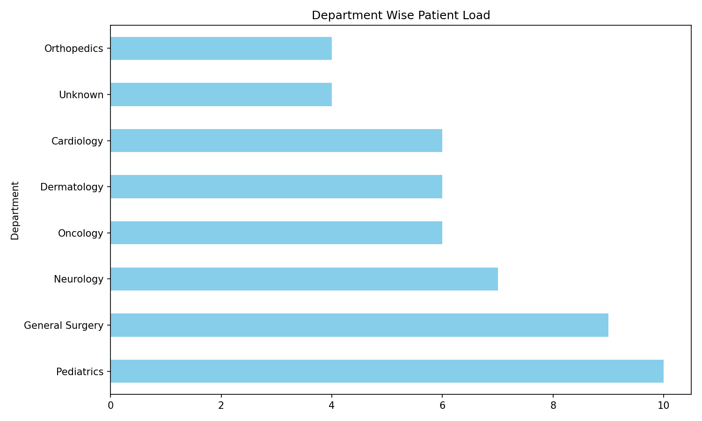
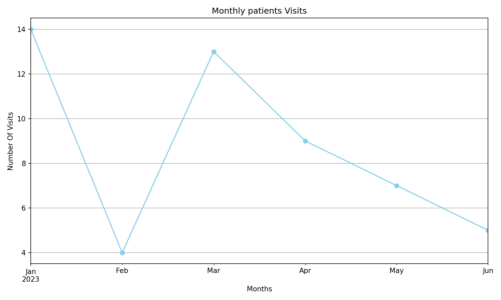
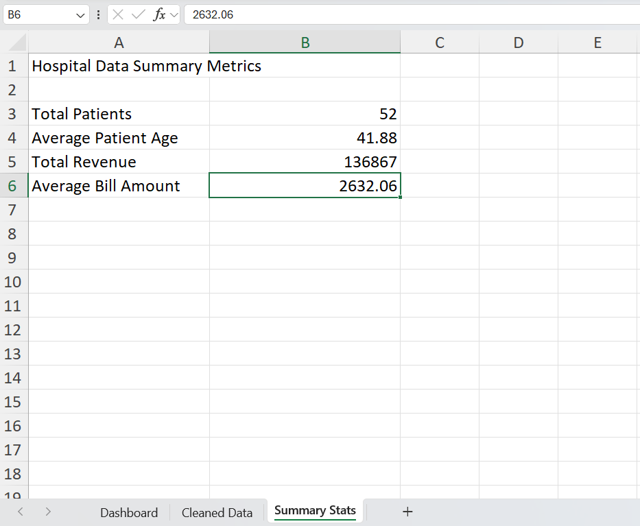

# Hospital Data Analytics Report — Automated with Python & Excel 📊  

  
  
  
  

## 📌 Problem  
Hospitals manage large volumes of data with missing, inconsistent, and invalid entries.  
Manual report generation is **time-consuming, error-prone, and inconsistent**.  

## ✅ Solution  
This project automates:  
- 🔹 Cleaning patient & visit records (NaN handling, invalid values)  
- 🔹 Department-wise patient load analysis  
- 🔹 Monthly visit trends & demographic summaries  
- 🔹 Auto-generated Excel report with **interactive charts**  

## Demo Screenshots

## 📈 Key Insights from Analysis  
- **Top 3 departments** with highest patient load  
- **Monthly patient trend** showing peak & low seasons  
- **Demographic breakdown** (age, gender, visits)  
- **Operational inefficiencies** (no-shows, duplicate records, invalid IDs

## Excel Report Download
[Download Hospital Data Report](Hospital_Records.csv)

## How to Run
1. Clone this repo
2. Install dependencies: `pip install pandas matplotlib openpyxl`
3. Run the Jupyter Notebook

